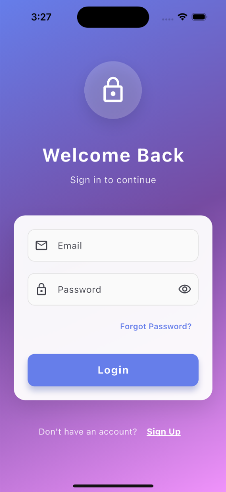
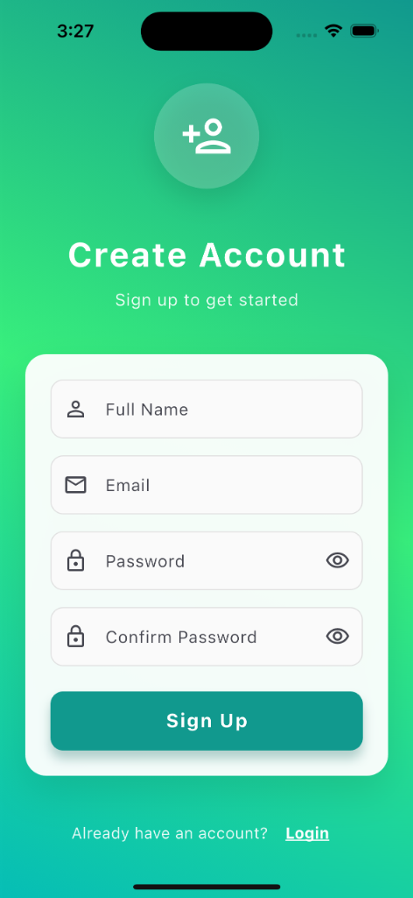

# Auth with Cubit - Flutter Authentication App

A Flutter authentication application with beautiful UI design featuring login and signup screens.

## Screenshots

<p align="center">
  
  
</p>

## Current Features

- **Login Screen**
  - Email and password input fields with validation
  - Password visibility toggle
  - "Forgot Password" link
  - Navigation to signup screen
  - Beautiful purple gradient background

- **Signup Screen**
  - Full name, email, password, and confirm password fields
  - Form validation including password matching
  - Password visibility toggles
  - Navigation back to login screen
  - Beautiful teal/green gradient background

## 🎯 Refactoring Task

The current codebase needs to be refactored to follow **clean code principles** and improve maintainability. The main objectives are:

### Requirements

1. **Clean Code Architecture**
   - Separate business logic from UI
   - Follow SOLID principles
   - Improve code readability and maintainability
   - Organize code into proper layers (presentation, domain, data)

2. **State Management with Cubit**
   - Implement Cubit (from flutter_bloc) for state management
   - Create separate Cubits for login and signup functionality
   - Handle loading, success, and error states properly

3. **User Feedback**
   - Show **success SnackBar** when login/signup succeeds
   - Show **error SnackBar** when login/signup fails
   - Display loading indicators during async operations

4. **Code Organization**
   - Create proper folder structure
   - Separate concerns (UI, business logic, models, etc.)
   - Make the code easier to test and extend

### Expected Outcome

After refactoring, the app should:
- ✅ Use Cubit for state management
- ✅ Display appropriate SnackBars for success/failure
- ✅ Follow clean architecture principles
- ✅ Be easier to read, maintain, and test
- ✅ Have clear separation of concerns

## Getting Started

### Prerequisites

- Flutter SDK (latest stable version)
- Dart SDK
- iOS Simulator / Android Emulator / Physical Device

### Installation

1. Clone the repository
```bash
git clone <repository-url>
cd auth_with_cubit
```

2. Install dependencies
```bash
flutter pub get
```

3. Run the app
```bash
flutter run
```

## Current Project Structure

```
lib/
├── main.dart
└── views/
    ├── login_view.dart
    └── signup_view.dart
```

## Technologies Used

- Flutter
- Dart
- Material Design 3

## License

This project is open source and available under the [MIT License](LICENSE).
